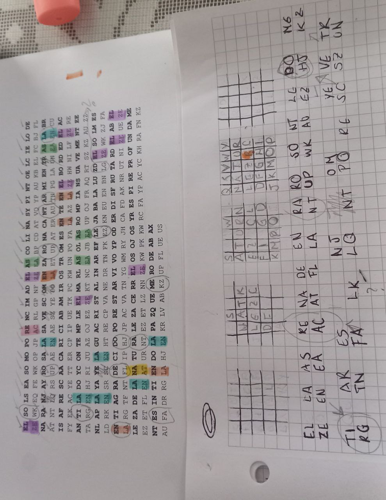

# Actividad en Clase, Playfair

1. Usa ChatGPT para crear un texto coherente con la misma cantidad (aprox) de vocales y en el que se usen al menos una vez todas las consonantes. 

La vida es como un camino que se extiende ante nosotros. A veces es fácil y fluido, otras veces es difícil y lleno de obstáculos. Pero es importante recordar que cada paso que damos nos acerca a nuestro destino.

Debemos tener fe en nosotros mismos y en nuestras habilidades para superar cualquier desafío que se nos presente. Es cierto que habrá momentos en los que nos sintamos perdidos o desorientados, pero nunca debemos olvidar que siempre hay una luz al final del túnel.

Así que sigamos caminando con determinación y coraje, sabiendo que cada paso que damos nos acerca un poco más a nuestras metas y sueños. La vida puede ser dura a veces, pero con perseverancia y dedicación, podemos superar cualquier cosa que se nos presente en el camino.

2. Crea un cuadro de Playfair para cifrar ese texto. Ese cuadro va a ser secreto.

| Q  | R  | S  | T  | U  |
|---|---|---|---|---|
| P  | E  | F  | G  | V  |
| O  |  D | A  |  H | W/X  |
| N |  C |  B |  I |  Y |
| M | L  |  K | J  |  Z |

3. Cifra el texto que creaste.

Para cifrar dividimos el texto en parejas:

La **(KD)** vi **(GY)** da **(AH)** es **(FR)** co **(ND)** mo **(QN)** un **(QY)** ca **(BD)** mi **(JN)** no **(MN)** qu **(RQ)** es **(FR)** ee **(FF)** xt **(HU)** ie **(CG)** nd **(CO)** ea **(FD)** nt **(IQ)** en **(PC)** os **(AQ)** ot **(HQ)** ro **(QD)** sA **(FB)** ve **(PF)** ce **(LD)** se **(RF)** sf **(FA)** ác **(DB)** il **(CJ)** yf **(BV)** lu **(ZR)** id **(CH)** oo **(DD)** tr **(US)** as **(BF)** ve **(PF)** ce **(LD)** se **(FR)** sd **(AR)** if **(BG)** íc **(YB)** il **(CJ)** yl **(CZ)** le **(RD)** no **(MN)** de **(CD)** ob **(AN)** st **(TU)** ác **(DB)** ul **(RZ)** os **(AQ)** Pe **(FE)** ro **(QD)** es **(FR)** im **(NJ)** po **(ON)** rt **(SU)** an **(OB)** te **(RG)** re **(ED)** co **(ND)** rd **(EC)** ar **(DS)** qu **(RQ)** ec **(DL)** ad **(HA)** ap **(OF)** as **(BF)** oq **(NP)** ue **(RV)** da **(AH)** mo **(QN)** sn **(QB)** os **(AQ)** ac **(DB)** er **(DE)** ca **(BD)** an **(OB)** ue **(RV)** st **(TU)** ro **(QD)** de **(CD)** st **(TU)** in **(YC)** oD **(DA)** de **(CD)** be **(CF)** mo **(QN)** st **(TU)** en **(PC)** er **(DE)** fe **(GF)** en **(PC)** no **(MN)** so **(QA)** tr **(US)** os **(AQ)** mi **(JN)** sm **(QK)** os **(AQ)** ye **(CV)** nn **(CC)** ue **(RV)** st **(TU)** ra **(SD)** sh **(TA)** ab **(BK)** il **(CJ)** id **(CH)** ad **(HA)** es **(FR)** pa **(FO)** ra **(SD)** su **(TQ)** pe **(EF)** ra **(SD)** rc **(EL)** ua **(SW)** lq **(MR)** ui **(TY)** er **(DE)** de **(CD)** sa **(FB)** fí **(GB)** oq **(NP)** ue **(RV)** se **(FR)** no **(MN)** sp **(QF)** re **(ED)** se **(FR)** nt **(IQ)** eE **(FF)** sc **(RB)** ie **(CG)** rt **(SU)** oq **(NP)** ue **(RV)** ha **(XH)** br **(CS)** ám **(OK)** om **(NQ)** en **(PC)** to **(QH)** se **(FR)** nl **(CM)** os **(AQ)** qu **(RQ)** en **(PC)** os **(AQ)** si **(TB)** nt **(IQ)** am **(OK)** os **(AQ)** pe **(EF)** rd **(EC)** id **(CH)** os **(AQ)** od **(DA)** es **(FR)** or **(DQ)** ie **(CG)** nt **(IQ)** ad **(HA)** os **(AQ)** pe **(EF)** ro **(QD)** nu **(YQ)** nc **(CB)** ad **(HA)** eb **(FC)** em **(PL)** os **(AQ)** ol **(DM)** vi **(GY)** da **(AH)** rq **(SR)** ue **(RV)** si **(TB)** em **(PL)** pr **(EQ)** eh **(GD)** ay **(WB)** un **(QY)** al **(DK)** uz **(VU)** al **(DK)** fi **(GB)** na **(BO)** ld **(RC)** el **(DR)** tú **(UQ)** ne **(CP)** lA **(KD)** sí **(TB)** qu **(RQ)** es **(FR)** ig **(JH)** am **(OK)** os **(AQ)** ca **(BD)** mi **(JN)** na **(BO)** nd **(CO)** oc **(DN)** on **(NM)** de **(CD)** te **(RG)** rm **(QL)** in **(YC)** ac **(DB)** ió **(NH)** ny **(CN)** co **(ND)** ra **(SD)** je **(LG)** sa **(FB)** bi **(IY)** en **(PC)** do **(AD)** qu **(RQ)** ec **(DL)** ad **(HA)** ap **(OF)** as **(BF)** oq **(NP)** ue **(RV)** da **(AH)** mo **(QN)** sn **(QB)** os **(AQ)** ac **(DB)** er **(DE)** ca **(BD)** un **(QY)** po **(ON)** co **(ND)** má **(KO)** sa **(BF)** nu **(YQ)** es **(FR)** tr **(US)** as **(BF)** me **(LP)** ta **(SH)** sy **(UB)** su **(TQ)** eñ **(PC)** os **(AQ)** La **(KD)** vi **(GY)** da **(AH)** pu **(VQ)** ed **(DC)** es **(FR)** er **(DE)** du **(XR)** ra **(SD)** av **(WF)** ec **(LD)** es **(FR)** pe **(EF)** ro **(QD)** co **(ND)** np **(MO)** er **(DE)** se **(FR)** ve **(PF)** ra **(SD)** nc **(CB)** ia **(BH)** yd **(CX)** ed **(DC)** ic **(YB)** ac **(DB)** ió **(NH)** np **(MO)** od **(DA)** em **(PL)** os **(AQ)** su **(TQ)** pe **(FE)** ra **(SD)** rc **(EL)** ua **(SW)** lq **(MR)** ui **(TY)** er **(DE)** co **(ND)** sa **(FB)** qu **(RQ)** es **(FR)** en **(PC)** os **(AQ)** pr **(EQ)** es **(FR)** en **(PC)** te **(RG)** en **(PC)** el **(DR)** ca **(BD)** mi **(JN)** no **(MN)**

4. Comparte en un archivo.txt ambos textos (el original y el cifrado). Lo vas a compartir en la carpeta del enlace. 

Original: 

La vi da es co mo un ca mi no qu es ee xt ie nd ea nt en os ot ro sA ve ce se sf ác il yf lu id oo tr as ve ce se sd if íc il yl le no de ob st ác ul os Pe ro es im po rt an te re co rd ar qu ec ad ap as oq ue da mo sn os ac er ca an ue st ro de st in oD de be mo st en er fe en no so tr os mi sm os ye nn ue st ra sh ab il id ad es pa ra su pe ra rc ua lq ui er de sa fí oq ue se no sp re se nt eE sc ie rt oq ue ha br ám om en to se nl os qu en os si nt am os pe rd id os od es or ie nt ad os pe ro nu nc ad eb em os ol vi da rq ue si em pr eh ay un al uz al fi na ld el tú ne lA sí qu es ig am os ca mi na nd oc on de te rm in ac ió ny co ra je sa bi en do qu ec ad ap as oq ue da mo sn os ac er ca un po co má sa nu es tr as me ta sy su eñ os La vi da pu ed es er du ra av ec es pe ro co np er se ve ra nc ia yd ed ic ac ió np od em os su pe ra rc ua lq ui er co sa qu es en os pr es en te en el ca mi no 

Cifrado:


KD GY AH FR ND QN QY BD JN MN RQ FR FF HU CG CO FD IQ PC AQ HQ QD FB PF LD RF FA DB CJ BV ZR CH DD US BF PF LD
FR AR BG YB CZ RD MN CD AN TU DB RZ AQ FE QD FR NJ ON SU OB RG ED ND EC DS RQ DL HA OF BF NP AH QN QB AQ DB DE
BD OB RV TU QD CD TU YC DA CD CF QN TU PC DE GF PC MN QA US AQ JN QK AQ CV CC RV TU SD TA BK CJ CH HA FR FO SD 
TQ EF SD EL SW MR TY DE CD FB GB NP RV FR MN QF ED FR IQ FF RB CG SU RV XH CS OK NQ PC QH FR CM AQ RQ PC TB IQ 
OK AQ EF EC CH AQ DA FR DQ CG IQ HA AQ EF QD YQ CB HA FC PL AQ DM GY AH SR RV TB PL EQ GD WB QY DK VU DK GB BO 
RC DR UQ CP KD TB RQ FR JH OK AQ BD JN BO CO DN NM CD RG QL YC DB NH CN ND SD LG FB IY PC AD RQ DL HA OF BF NP 
RV AH QN QB AQ DB DE BD QY ON ND KO BF YQ FR US BF LP SH UB TQ PC AQ KD GY AH VQ DC FR DE XR SD WF LD FR EF QD 
ND MO DE FR PF SD CB BH CX DC YB DB NH MO DA PL AQ TQ FE SD EL SW MR TY DE ND FB RQ FR PC AQ EQ FR PC RG PC DR 
BD JN MN

5. De la carpeta, escoge un archivo y recrea el cuadro de playfair. 

Tomando el archivo `RicardoLuévano_KarinaPrado.txt` procedemos a buscar el cuadro de playfair correspondiente:

Texto:

El sol se asomó por encima de las colinas y pintó el cielo de naranja y rosa.Las aves comenzaron a cantar mientras la brisa fresca acariciaba mi rostro.Me senté en el borde del acantilado y contemplé el mar. Las olas rompían suavemente en la playa y el agua cristalina reflejaba la luz del sol.Me sentí agradecido por estar vivo y poder disfrutar de la belleza de la naturaleza. Cerré los ojos y respiré profundamente, sintiendo la paz que me rodeaba

EL SO LS EA SO MO PO RE NC IM AD EL AS CO LI NA SY PI NT OE LC IE LO DE NA RA NJ AY RO SA LA SA VE SC OM EN ZA RO NA CA NT AR MI EN TR AS LA BR IS AF RE SC AA CA RI CI AB AM IR OS TR OM ES EN TE EN EL BO RD ED EL AC AN TI LA DO YC ON TE MP LE EL MA RL AS OL AS RO MP IA NS UA VE ME NT EE NL AP LA YA YE LA GU AC RI ST AL IN AR EF LE JA BA LA LU ZD EL SO LM ES EN TI AG RA DE CI DO PO RE ST AR VI VO YP OD ER DI SF RU TA RD EL AB EL LE ZA DE LA NA TU RA LE ZA CE RR EL OS OJ OS YR ES PI RE PR OF UN DA ME NT ES IN TI EN DO LA PA ZQ UE ME RO DE AB AX 


Texto cifrado:

ZE WK EQ FE WK OP JP AC RL GP NF ZE EA BP CD AT VQ YP AU KB EL FC BJ FL AT NT LQ RS UP AE EN AE SZ YE PO LA ET UP AT ER AU TN PG LA UN EA EN CU FY EK AC YE TT ER CP IP UE TK PC KW UN PO FA LA AZ LA ZE HW NI LF ZE RE TA RG EN HJ RI JU AZ OJ EZ ZE KT NC EA JB EA UP OJ FR AQ RT SZ KZ AU ZZ LD RK EN SR SC EN HT RE CP VA NE DR TN FK EZ KN EU EN BN LG ZE WK ZJ FA LA RG TF NT FL IP HJ JP AC VA TN YG WM RY JH CA FD AK NR UT NI ZE UE ZE EZ ET FL EN AT UR NT EZ ET LZ NN ZE KW PK KW RC FA YP AC YC KH RA FN KZ AU FA DR RG LA HJ EN KR LV AB KZ UP FL UE US 

Para encontrar el cuadro de *Playfair* decidí hacer un programa para el texto cifrado en python, el cual hara una lista de las parejas con mayor frecuencia de aparicion en el texto cifrado. 

``` python

string = "ZE WK EQ FE WK OP JP AC RL GP NF ZE EA BP CD AT VQ YP AU KB EL FC BJ FL AT NT LQ RS UP AE EN AE SZ YE PO LA ET UP AT ER AU TN PG LA UN EA EN CU FY EK AC YE TT ER CP IP UE TK PC KW UN PO FA LA AZ LA ZE HW NI LF ZE RE TA RG EN HJ RI JU AZ OJ EZ ZE KT NC EA JB EA UP OJ FR AQ RT SZ KZ AU ZZ LD RK EN SR SC EN HT RE CP VA NE DR TN FK EZ KN EU EN BN LG ZE WK ZJ FA LA RG TF NT FL IP HJ JP AC VA TN YG WM RY JH CA FD AK NR UT NI ZE UE ZE EZ ET FL EN AT UR NT EZ ET LZ NN ZE KW PK KW RC FA YP AC YC KH RA FN KZ AU FA DR RG LA HJ EN KR LV AB KZ UP FL UE US"

pairs = {}
for i in range(len(string)-1):
    pair = string[i:i+2]
    if pair in pairs:
        pairs[pair] += 1
    else:
        pairs[pair] = 1

sorted_pairs = sorted(pairs.items(), key=lambda x: x[1], reverse=True)
for pair, frequency in sorted_pairs:
    print(pair, frequency)

```

Usando el programa anterior se obtuvo la lista de las siguientes frecuencias 

``` python
ZE 13
EN 12
EA 10
AC 8
AT 8
FL 8
LA 8
NT 8
UP 8
WK 8
AU 7
EZ 7
HJ 7
KZ 7
RG 7
TN 7
FA 6
LK 6
LQ 6
NT 6
PO 6
RE 6
SC 6
SZ 6
UN 6
```

Asi que comence hacer el cuadro de Playfair con las parejas de  mayor a menor frecuencia, acomodando del centro para afuera, de esta manera se puede recorrer filas 

|   |   | S  |   |   |
|---|---|---|---|---|
|   | N  | A  | T  | R  |
|   | L  | E  | Z  | C  |
|   | D  | F  |   |   |
|   |   |   |   |   |

$$\rightarrow$$

| S  |   |   | W  |   |
|---|---|---|---|---|
| A  | T  | U  |  R | N  |
|  E |  Z |   |  C |  L |
|  F | I |   |  G |  D |
|  J |  K | M  |  P |  O | 

$$\rightarrow$$

Obteniendo como cuadro final el siguiente:

| Q   | S  | V  |  W/X | Y  |
|---|---|---|---|---|
|  N |  A |  T |  U |R   |
| L  |  E |  Z | B  | C  |
| D  |  F |  G |  H |  I |
|  J | K  |  M | O  |  P |




6. En otro archivo, adjunta: tu texto, tu texto cifrado, el texto sin cifrar y cifrado que escogiste, el cuadro de Playfair con el que fue hecho.
Muestra todas las deducciones que hiciste y el paso a paso de cómo lo construiste (esto puede ser con fotografías de notas a mano).

Valor extra para la tarea, 5 puntos:
7. Programa (de su creación) el algoritmo para dado un texto cifrado y ayuda de fragmentos de texto claro conocido, obtén el cuadro con el que fue hecho. Fecha de entrega: Domingo.

 