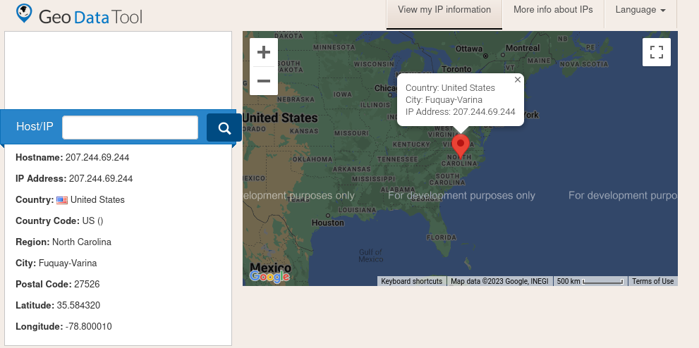
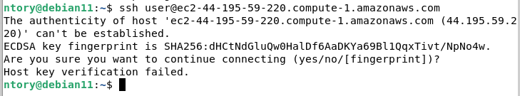
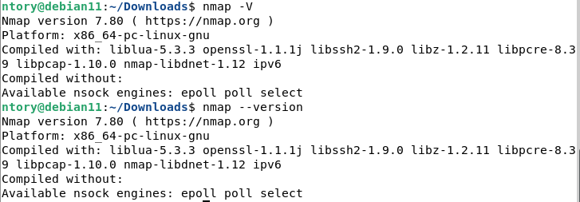
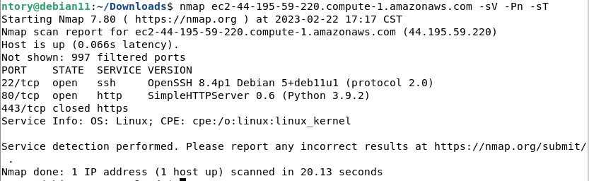

# Práctica 1-OSINT

Azpeitia García Karyme Ivette

Pedro Méndez Jose Manuel 

## 2.1 Información personal


| 
|:----------------------:|
| Imagen sobre la que trabajamos utilizando la herramienta: _Exif.tools_.

----

1. ¿Cuál es el nombre real del archivo? Es decir, el nombre que se le dió por el sistema operativo.

 `File name: phpCjd4Yf`

2. ¿Qué marca es la cámara con la que fue tomada la foto?
```
Make:	Sony
Camera Model Name:	H8216
```

De acuerdo a la información anterior la foto fue tomada por un celular `Sony Xperia XZ2(H8216)`

3. ¿De qué color son las carpas del restaurante latino a unas calles?

El restaurante latino ubicado a unas calles de nombre `Las Iguanas - London - Royal Festival Hall`  tiene carpas color azul cielo y rojas.


## 2.2 Información técnica de un sistema

Sitio web investigado: [Game's website](https://www.friv.com).

Para conseguir información de la pagina web será necesario conocer la `dirección IP` de esta.

#### Obteniendo la dirección IP del website 

```terminal
~ %  nslookup https://www.friv.com  

Server:	10.0.2.3
Address: 10.0.2.3#53

Non-authoritative answer:
Name:	https://www.friv.com
Address: 207.244.69.244
```

Utilizando los siguientes sitios, recabamos la siguiente información:
* [Whois.domaintools](https://whois.domaintools.com/207.244.69.244): La localización de la dirección IP del servidor: United States United States Washington Mass Division Of Employment Training, pero no encontramos mucha información relevante.

* [Geo Data Tool](https://www.geodatatool.com/en/?ip=207.244.69.244)

| 
|:----------------------:|
| Información obtenida usando Geo Data Tool.

* [Who.is](https://who.is/whois/friv.com): Aquí pudimos encontrar varias direcciones ip y saber que están trabajando con google. En este caso decidimos investigar más con:

> www.friv.com - A -  498   -  207.244.86.26

##### Información obtenida
```

Hostname: 207.244.69.244
IP Address: 207.244.69.244

Registrant Contact Information:

NameRedacted for Privacy
OrganizationPrivacy service provided by Withheld for Privacy ehf
Country:   United States
Country Code: US ()
Region: North Carolina
City: Fuquay-Varina
Postal Code: 27526
Latitude: 35.584320
Longitude: -78.800010
AddressKalkofnsvegur 2
CityReykjavik
State / ProvinceCapital Region
Postal Code101
CountryIS
Phone+354.4212434


Administrative Contact Information:

NameRedacted for Privacy
OrganizationPrivacy service provided by Withheld for Privacy ehf
AddressKalkofnsvegur 2
CityReykjavik
State / ProvinceCapital Region
Postal Code101
CountryIS
Phone+354.4212434

Technical Contact Information:

NameRedacted for Privacy
OrganizationPrivacy service provided by Withheld for Privacy ehf
AddressKalkofnsvegur 2
CityReykjavik
State / ProvinceCapital Region
Postal Code101
CountryIS
Phone+354.4212434
```

* Utilizando [el motor de busqueda de los hackers](https://www.shodan.io/host/207.244.69.244) nos encontramos que el SO ocupado es Debian y al momento de realizar la busqueda nos encontramos con los puertos 22,80 y 443 abiertos.

## 2.3 Información práctica de un sistema

* Verificamos la conección:

| 
|:----------------------:|
| Verificación de que la instancia está a nuestro alcance.

### 2.3.1 Escaneo de puertos usan nmap

| 
|:----------------------:|
| Versión de nmap utilizada para la practica.

| 
|:----------------------:|
| Resultado de la ejecución.

1. ¿Cuántos activos tiene la instancia? 3

2. ¿Cuántos puertos están cerrados?  1, el 443

3. ¿Cuántos puertos están abiertos? 2, el 22 y 80 que no esta cerrado porque es el encargado de dar el servicio.

4. ¿Cuál es la versión del puerto 80? Server: SimpleHTTP/0.6 Python 3.9.2, información obtenida con [shodan](https://www.shodan.io/host/44.195.59.220)


5. ¿Qué hacen los parámetros que se le pasaron a nmap?
- -sV: Nos proporciona los servicios y versiones de los puertos encontrados.
- -Pn: Trata a los hosts como si fuera online.(skip host discovery)
- -sT: Hace análisis de TCP SYN/Connect()/ACK/Window/Maimon
- El augmento **-p -10000** en nmap nos permite escanear los primeros 10000 puertos.

---
6. Obten una lista de palabras (mejor conocida como wordlist) de algún sitio o fuente confiable, con ella realiza un escaneo y encuentra la bandera oculta dentro de la aplicación HTTP en la práctica.

Utilizando gobuster para realizar el escaneo de directorios obtuvimos:

# Notes:
* El augmento -p -10000 en nmap nos permite escanear los primeros 10000 puertos.

------
📢⌨️ with ❤️ by [Jose-MPM](https://github.com/Jose-MPM) 😊⌨️ and [Kary-GOD](https://github.com/Kary-AG) 😊⌨️🎁