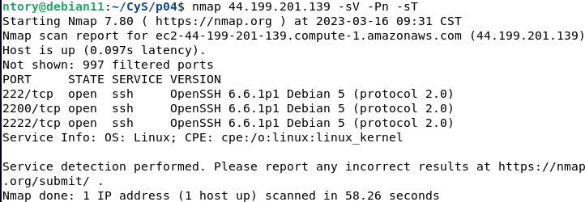

# Práctica 4 - SSH multiverse

Azpeitia García Karyme Ivette

Pedro Méndez Jose Manuel 

## Procedimiento.

### Escanear el objetivo

Primero realizaremos un escaneo de puertos para encontrar y recopilar información sobre los puertos están activos escuchando by SSH, apoyandonos de nmap ejecutando este comando:

```bash
nmap 44.199.201.139 -sV -Pn -sT
```


| 
|:----------------------:|
| Imagen sobre la que trabajamos utilizando la herramienta: _Exif.tools_.

* Podemos observar que el servidor tiene los puertos abiertos para SSH abiertos:
	* 222/tcp  open  ssh     OpenSSH 6.6.1p1 Debian 5 (protocol 2.0)
	* 2200/tcp open  ssh     OpenSSH 6.6.1p1 Debian 5 (protocol 2.0)
	* 2222/tcp open  ssh     OpenSSH 6.6.1p1 Debian 5 (protocol 2.0)

### Atacar al objetivo: 

Obtener mediante un ataque de diccionario la contraseña correspondiente a su  usuario (utilizando Hydra por ejemplo).

* Primero instalaremos Hydra en nuestra AttackBox con el siguiente comando:
```bash
sudo dnf install hydra -y
```
###  Crear evidencia de haber entrado al sistema

La parte más sencilla, basta que ejecuten $ touch $NumeroDeCuenta para dejar registro que estuvieron ahí.

### Post-explotación.

------
📢⌨️ with ❤️ by [Jose-MPM](https://github.com/Jose-MPM) 😊⌨️ and [Kary-GOD](https://github.com/Kary-AG) 😊⌨️🎁