# Práctica 6 - CVE-2017-0144

* Integrantes:
	- Pedro Méndez Jose Manuel - 315073120
	- Azpeitia García Karyme Ivette - 317340385

## EternalBlue y la filtración Lost in Translation de The Shadow Brokers

En 2017, un grupo de hackers autodenominados **"The Shadow Brokers"** filtró una serie de herramientas de hacking de la Agencia de Seguridad Nacional (NSA) de los Estados Unidos, incluyendo una herramienta llamada EternalBlue. Esta herramienta explotaba una **vulnerabilidad** en el protocolo de comunicación SMB (Server Message Block) utilizado en sistemas operativos Windows. La filtración de EternalBlue permitió a los ciberdelincuentes llevar a cabo ataques de ransomware y otros tipos de ataques cibernéticos a gran escala.

Uno de los ataques más notorios que utilizó la herramienta EternalBlue fue el **ransomware WannaCry**, que afectó a más de 200,000 computadoras en todo el mundo y causó pérdidas económicas significativas. Otro ataque importante que utilizó la herramienta fue el ataque **NotPetya**, que se cree que causó más de mil millones de dólares en daños.

La filtración de The Shadow Brokers puso de manifiesto las debilidades en la seguridad cibernética de la NSA y puso en peligro la seguridad de millones de sistemas operativos Windows en todo el mundo. Desde entonces, se ha hecho un esfuerzo para parchear la vulnerabilidad explotada por EternalBlue y otras herramientas filtradas, pero **la amenaza persiste ya que muchos sistemas no se han actualizado adecuadamente**.

En resumen, la filtración de EternalBlue y otras herramientas de hacking de la NSA por parte de The Shadow Brokers fue un evento significativo en la historia de la seguridad cibernética y destacó la necesidad de una mejor seguridad en línea y protección de datos sensibles.

## Banderas

- `flag{access_the_machine}`
- `flag {sam_database_elevated_access}`
- `flag{admin_documents_can_be_valuable}`

| 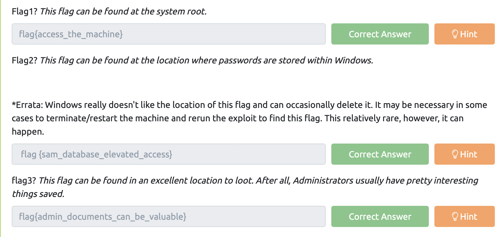
|:----------------------:|
| Banderas del laboratorio
## Procedimiento para  completar el room

Primero se hizo un **escaneo**  con la herramienta `nmap`, usando las opciones para realizar un escaneo de servicios en los puertos abiertos, utilizando el script "vuln" para identificar vulnerabilidades conocidas en esos servicios. Para tener información valiosa sobre posibles debilidades que podrían ser explotadas.

Con esto se resolvió  *Task 1: Recon*

| 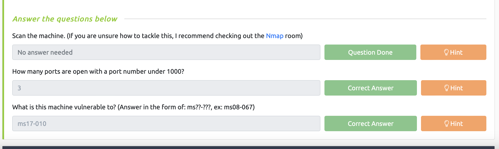
|:----------------------:|
| 

| 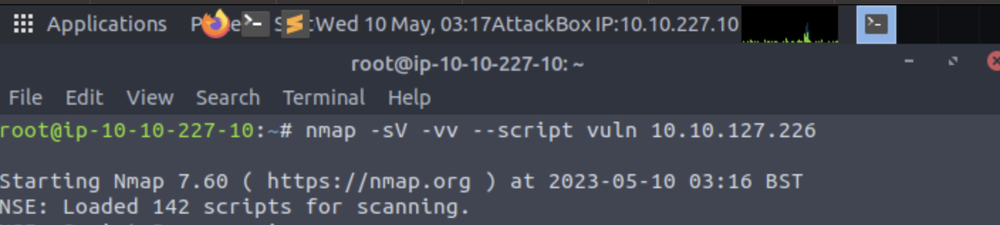
|:----------------------:|
| nmap

| 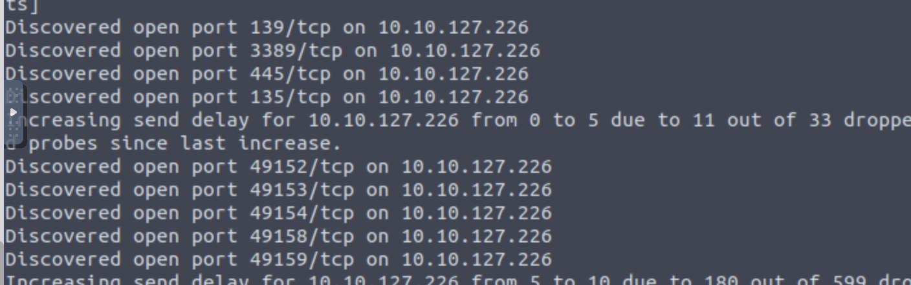
|:----------------------:|
| Puertos abiertos

| 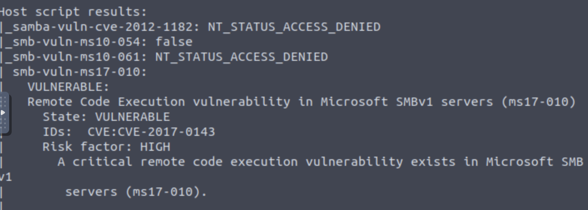
|:----------------------:|
| vulnerabilidad

De acuerdo al escaneo anterior sabemos que la máquina tiene la vulnerabilidad de ejecución `ms17-010`, la cuál vamos a usar para poder **ganar acceso**, lo cuál hacemos usando `metasploit`

| 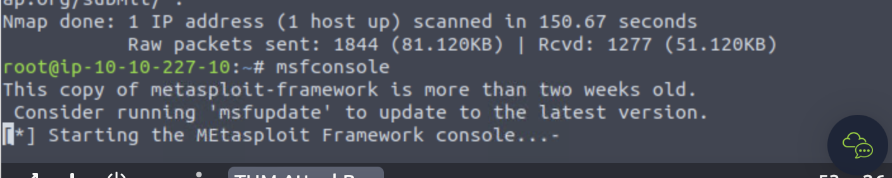
|:----------------------:|
| iniciando metasploit

Ya iniciado metasploit, buscamos la ruta del código de explotación para ejecutar en la máquina teniendo en cuenta la vulnerabilidad y entramos. 

| 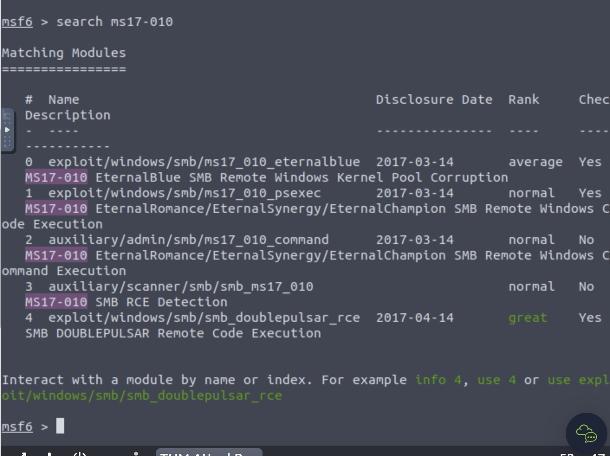
|:----------------------:|
| ruta del código

| 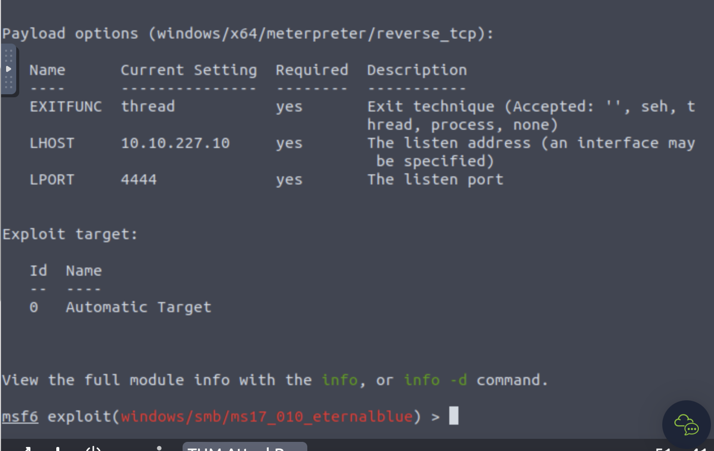
|:----------------------:|
| mostrando opciones

Utilizamos `set rhosts` para establecer la dirección IP en Metasploit antes de ejecutar un ataque o prueba de penetración contra dicho objetivo. Permitiendo configurar la herramienta para dirigir los exploits y las acciones posterior a esto lo ejecutamos `run`, entrando a shell.

| 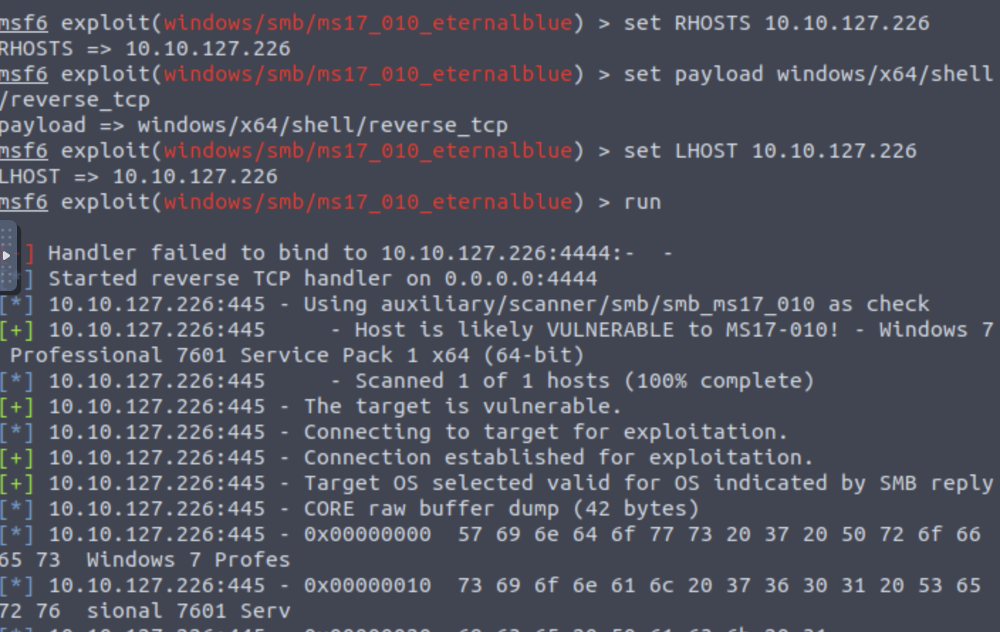
|:----------------------:|
| Entrando a shell
 

Con lo anterior se resuelve *Task 2: Gain Access*

| 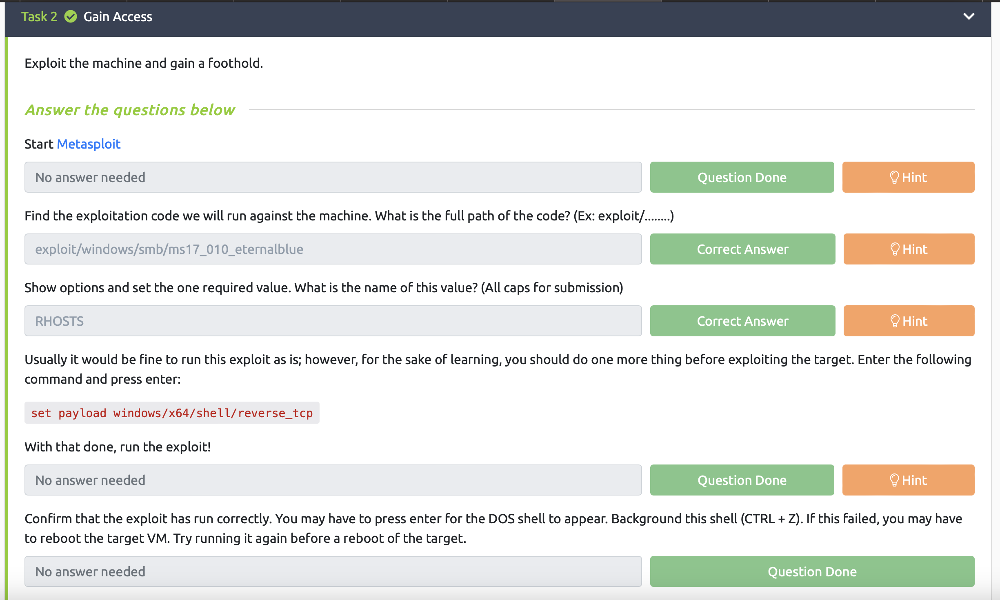
|:----------------------:|
| 

Salimos de shell usando `CTRL + z`, después  usamos `shell_to` para buscar los módulos que se usaran, seleccionamos el número de modulo y posterior a esto buscamos las sesiones activas. 

| 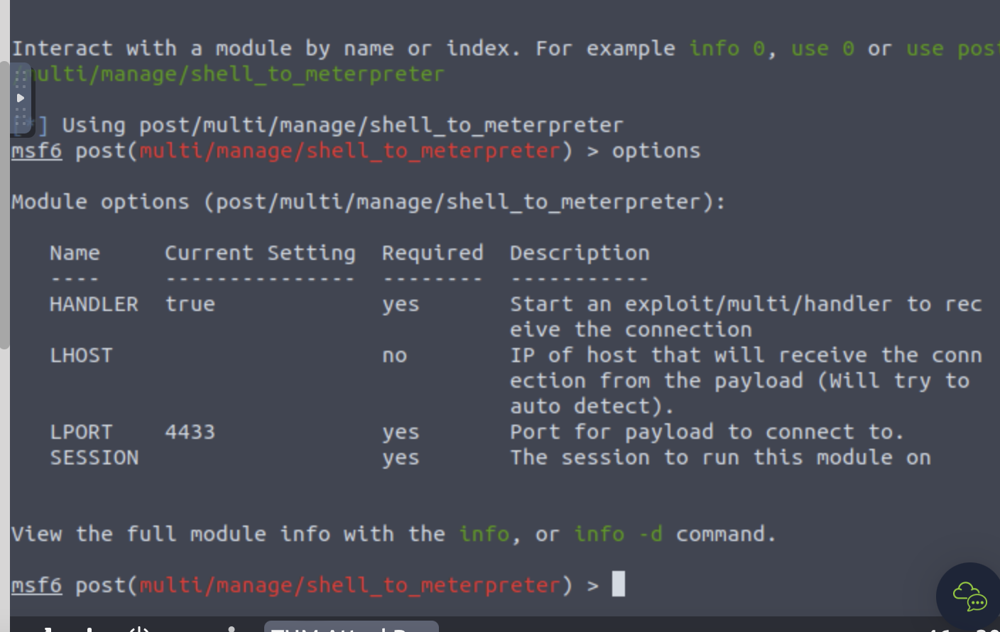
|:----------------------:|
| 

Concluimos *Task 3: Escalate*

| 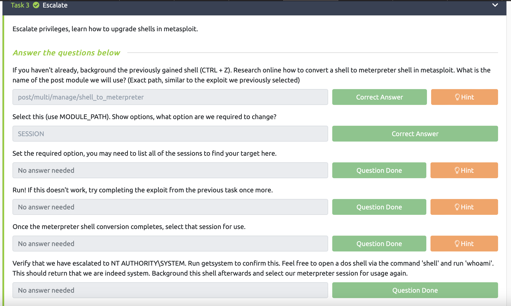
|:----------------------:|
| 

Ahora, es momento de obtener el el hash de la contraseña del usuario y descifrarlo, para esto nos  ubicamos en `meterpreter` y seguimos instrucciones de tryhackme usando `hashdump` y pposterior a esto entramos  encontrando la contraseña `alqfna22` con (Jon).

Terminado  *Task 4: Cracking*

| 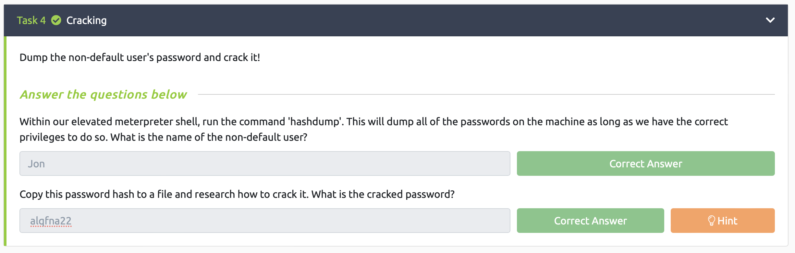
|:----------------------:|
| 

Empezamos a buscar las banderas con comandos entrndo a shell `dir, pwd, cat`.

*(Las banderas se encuentran en la primera sección)*

### Cuenta que realizo el laboratorio.

Username: [karime.123406](https://tryhackme.com/p/karime.123406)
## Opinion 

*La NSA es un tanto responsable del impacto de Wannacry porque decidió no revelar sino almacenar vulnerabilidades en Windows lo cuál impidió que Microsoft pudiera corregirlas y prevenir los ataques de ransomware posteriores*

De acuerdo a la investigación, considero que como lo dice el enunciado anterior la NSA es parcialmente responsable del impacto de WannaCry ya que la decisión de almacenar vulnerabilidades en lugar de revelarlas y permitir que Microsoft las parcheara no fue la mejor. Mantener las vulnerabilidades en secreto para poder utilizarlas en espionaje o ciberataques puede tener consecuencias graves para la seguridad cibernética en general.

La filtración de EternalBlue por parte de The Shadow Brokers permitió a los ciberdelincuentes aprovecharse de la vulnerabilidad en sistemas operativos Windows y llevar a cabo ataques a gran escala. Si la NSA hubiera revelado la vulnerabilidad y permitido que se parcheara antes de que fuera explotada, se habría reducido significativamente el riesgo de que se produjeran ataques de ransomware como WannaCry.

Es importante que los gobiernos y las agencias de inteligencia consideren los riesgos a largo plazo para la seguridad cibernética en lugar de centrarse solo en los beneficios a corto plazo de mantener las vulnerabilidades en secreto. La colaboración y la transparencia entre los investigadores de seguridad, los proveedores de software y las agencias gubernamentales son fundamentales para proteger los sistemas y datos en línea de manera efectiva.

## Punto Extra